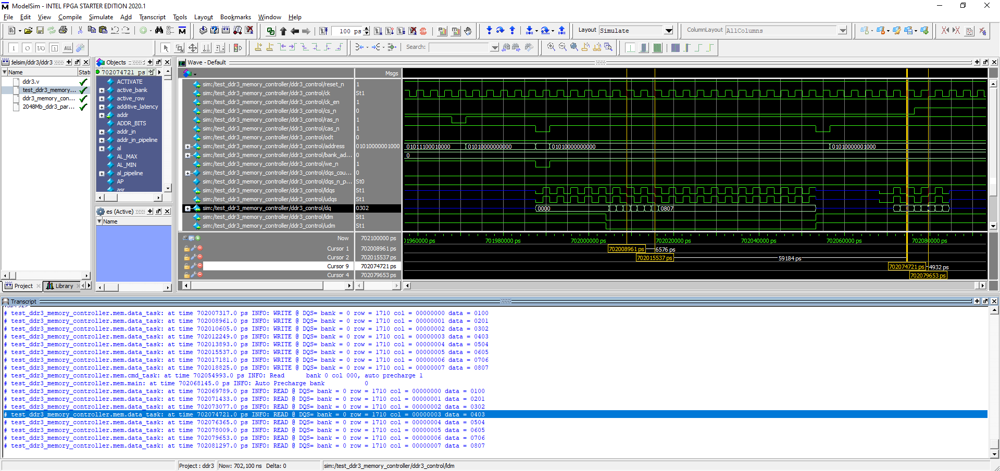

# DDR
A simple DDR3 memory controller for [Micron DDR3 RAM](https://www.micron.com/products/dram/ddr3-sdram/part-catalog/mt41j128m16jt-125)

TODO:
1. Implement more functionalities since the current verilog code does not yet support Additive Latency (AL), write-leveling mode, self-refresh mode, inserting other DRAM commands within write or read bursts data operation for a smarter DRAM controller
2. Implement [Type-III digital PLL described in Floyd Gardner book: Phaselock Techniques, 3rd Edition](https://www.reddit.com/r/AskElectronics/comments/9i7g9j/loop_stability_of_type_3_digital_pll/) for high-speed application and `DQS` phase-shift purpose
3. Investigate high-speed DDR PHY IO as described in reference \[1\], [2], [3], [4], [5], [6]
4. Design my own DDR3 FPGA board

Notes on Modelsim simulation for Micron DDR3 memory simulation model:
1. Creates a working directory named as `ddr3` and copies `ddr3_memory_controller.v`, `test_ddr3_memory_controller.v`, `2048Mb_ddr3_parameters.vh`, `ddr3.v`
2. Issues command : `vsim -gui work._2048Mb_ddr3_parameters_vh_unit work.ddr3 work.ddr3_memory_controller work.ddr3_memory_controller_v_unit work.test_ddr3_memory_controller`
3. Issues command : `source modelsim_wave.do` followed by `run 710us`
4. To restart simulation from timestep zero, just issue command : `restart`

Credit: [@Elphel](https://blog.elphel.com/2014/06/ddr3-memory-interface-on-xilinx-zynq-soc-free-software-compatible/), [@Morin](https://github.com/MartinGeisse), [@Greg](https://github.com/gregdavill/), [@BrianHG and @NorthGuy](https://www.eevblog.com/forum/fpga/ddr3-initialization-sequence-issue/) for their helpful technical help and explanation

Reference:

\[1]: [Preamble detection and postamble closure for a memory interface controller](https://patents.google.com/patent/US8023342)

\[2]: [Circuit design technique for DQS enable/disable calibration](https://patents.google.com/patent/US9158873)

\[3]: [Dqs generating circuit in a ddr memory device and method of generating the dqs](https://patents.google.com/patent/KR20050101864A/en)

\[4]: [DQS strobe centering (data eye training) method](https://patents.google.com/patent/US7443741B2/en)

\[5]: [Data strobe enable circuitry](https://patents.google.com/patent/US9001595)

\[6]: [Bimodal serial to parallel converter with bitslip controller](https://patents.google.com/patent/US6985096)
